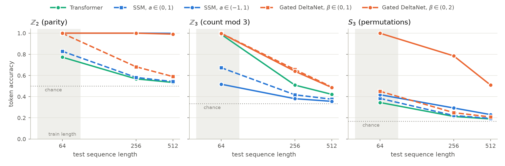
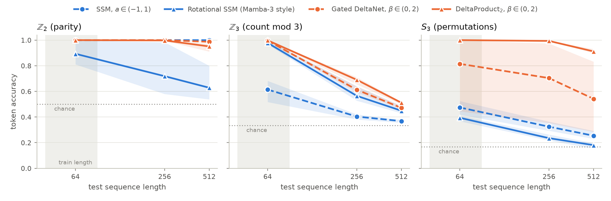

# Fading Memory

**Where do state-space models fail on recall and state tracking, and what fixes them?**

EE798R (Pattern Recognition) course project. Modern LLMs are replacing most attention layers with
linear-time recurrent mixers: Mamba-2/3, Gated DeltaNet (Qwen3-Next), KDA (Kimi Linear),
Mamba-2 hybrids (IBM Granite 4.0, NVIDIA Nemotron-H). These layers compress the whole past into a
**fixed-size, fading memory**, while attention keeps an **exact, growing** memory (the KV cache).
This project measures what that trade-off costs and what it buys, with every mixer implemented
from scratch:

| | Question | Experiment |
|---|---|---|
| **RQ1** | How much can a fixed-size state recall? | MQAR accuracy vs. number of key-value pairs, width and state size |
| **RQ2** | Which transitions can track state? | Running products in Z2 (parity), Z3 and S3; negative-eigenvalue fix (Grazzi et al., ICLR 2025); length generalisation |
| **RQ3** | How much attention does a hybrid need, and where? | 4-layer SSM with 0-4 attention layers at different depths |
| **RQ4** | What does the linear-time mixer buy on a real GPU? | Latency / memory vs. sequence length, decode latency vs. context, Triton scan kernel and roofline analysis |

## What is implemented

| Component | File | Notes |
|---|---|---|
| Selective SSM (Mamba-2 / SSD style) | `src/fadingmem/layers/ssm.py` | recurrent reference + chunkwise-parallel scan, negative-eigenvalue option, O(1) decoding |
| Gated DeltaNet | `src/fadingmem/layers/deltanet.py` | recurrent reference + chunkwise WY/UT form (triangular solve), `beta in (0,2)` option |
| Causal attention + RoPE | `src/fadingmem/layers/attention.py` | Transformer baseline, KV-cache decoding, attention-map extraction |
| Triton scan kernel | `src/fadingmem/layers/triton_scan.py` | forward-only; state held in registers; tested in `TRITON_INTERPRET` mode |
| Hybrid model | `src/fadingmem/model.py` | layer pattern string, e.g. `"MAMM"` |
| Tasks | `src/fadingmem/tasks/` | MQAR, selective copying, group-word state tracking (Z_m, S_k) |
| Training / sweeps / benchmarks | `src/fadingmem/train.py`, `scripts/` | YAML configs, resumable sweeps, CSV summaries |
| Report | `report/` | LaTeX skeleton following the course guideline sections |

Every chunked (parallel) algorithm is unit-tested against its step-by-step recurrence to float64
precision, and every model's token-by-token decoding is tested against its parallel forward pass
(`pytest`, 43 tests).

## First results

**RQ2, state tracking** (RTX 4050, mean of 3 seeds, 2 layers, trained on length 64). Full table:
`report/tables/state_tracking.tex`.



| Test length 512 (mean of 3 seeds) | Z2 (parity) | Z3 | S3 |
|---|---|---|---|
| Transformer | 0.537 | 0.422 | 0.188 |
| SSM, a in (0,1) | 0.546 | 0.405 | 0.193 |
| SSM, a in (-1,1) | **0.999** | 0.368 | 0.254 |
| Gated DeltaNet, beta in (0,1) | 0.586 | 0.479 | 0.209 |
| Gated DeltaNet, beta in (0,2) | **0.987** | 0.472 | 0.542 (seeds 0.51 / 0.83 / 0.28) |
| *Rotational SSM (Mamba-3 style)* | 0.628 | 0.449 | 0.181 |
| *DeltaProduct2, beta in (0,1)* | 0.593 | 0.516 | 0.209 |
| *DeltaProduct2, beta in (0,2)* | 0.951 | 0.511 | **0.912** (seeds 0.90 / 0.91 / 0.93) |

- Negative eigenvalues are what make parity length-generalise.
- DeltaProduct2 with beta in (0,2) is the only model that learns S3 reliably and keeps 91% at 8x the
  training length.
- Z3 resists every model: several fit length 64 almost perfectly, then fall to about 0.5 at 512.
- The rotational SSM can represent Z3 but does not learn it. It fits short training lengths (1.00 at 16,
  0.72 at 64) and never generalises; its learned angles are not multiples of 120 degrees
  (`scripts/inspect_rotation.py`).



Smoke-test note for RQ1: on MQAR, a 2-layer attention model with one 64-dimensional head reaches
about 91% in 3k steps, while the same model with 2 or 4 narrower heads stalls near 53%. Recall
results are very sensitive to such choices, so the sweeps tune the learning rate per architecture.

## Setup

Windows users: see **[docs/SETUP_WINDOWS.md](docs/SETUP_WINDOWS.md)**. WSL2 is recommended for Triton.

```bash
python -m venv .venv && source .venv/bin/activate        # Windows: .venv\Scripts\activate
pip install torch --index-url https://download.pytorch.org/whl/cu130   # or the command from pytorch.org/get-started
pip install -e ".[dev]"
pytest                                                    # 43 passed (Triton test skipped without GPU)
python -m fadingmem.train --config configs/smoke.yaml     # ~1 min on CPU; the SSM should reach ~50-60%
```

## Running the experiments

```bash
# single runs (any config value can be overridden with section.key=value)
python -m fadingmem.train --config configs/parity.yaml model.pattern=M model.neg_eigen=true
python -m fadingmem.train --config configs/mqar.yaml model.pattern=D task.num_kv_pairs=32

# sweeps -> results/<sweep>/summary.csv   (resumable: finished runs are skipped)
python scripts/sweep.py configs/sweeps/state_tracking.yaml          # RQ2, 15 runs
python scripts/sweep.py configs/sweeps/recall_capacity.yaml         # RQ1, 120 runs (use --only to subset)
python scripts/sweep.py configs/sweeps/hybrid_placement.yaml        # RQ3, 14 runs
python scripts/sweep.py configs/sweeps/state_tracking.yaml --seeds 0 1 2   # error bars

# efficiency on your GPU -> results/benchmark/*.csv
python scripts/benchmark.py --which layer scan decode
```

## Repository layout

```
configs/            task configs + sweeps/ (cartesian grids of overrides)
src/fadingmem/
  layers/           ssm.py, deltanet.py, attention.py, triton_scan.py, common.py
  tasks/            recall.py (MQAR, selective copy), state_tracking.py (group words)
  model.py          hybrid sequence model
  train.py          training + evaluation (incl. per-position accuracy, length generalisation)
scripts/            sweep.py, benchmark.py
tests/              equivalence and correctness tests
report/             LaTeX report (main.tex, sections/, refs.bib)
docs/               setup notes
```

## Roadmap

- [x] Mixers from scratch (SSM, Gated DeltaNet, attention) with verified parallel forms
- [x] Synthetic tasks, training loop, sweeps, benchmark harness
- [x] Triton forward scan kernel (interpreter-tested)
- [x] State-tracking sweep on the RTX 4050, plotting script (`scripts/plot_results.py`)
- [x] Extensions: rotational SSM (Mamba-3 style) and DeltaProduct, with tests
- [x] GPU sweeps for the extensions (`state_tracking`, `rotation_length`)
- [ ] Angle figure from GPU checkpoints (`scripts/inspect_rotation.py`)
- [ ] Remaining sweeps, qualitative figures (state heatmaps, attention maps)
- [ ] Triton backward kernel, then compare with the chunked PyTorch path during training
- [ ] Stretch: complex / rotational transitions (Mamba-3 style) for Z_m, small TinyStories language model
- [ ] Write the report

## Attribution

All model, task and kernel code in this repository was written for this project, following the
equations in the cited papers (Mamba-2 / SSD, Gated DeltaNet, DeltaNet chunkwise algorithm,
Zoology MQAR, Grazzi et al. negative eigenvalues). No external implementation is imported or
copied. See `report/refs.bib` for the references.
